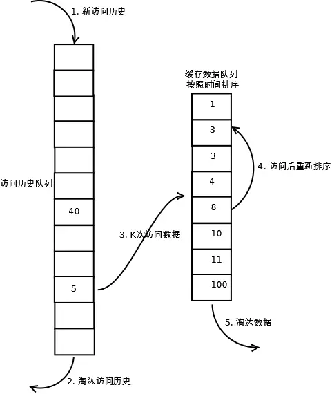
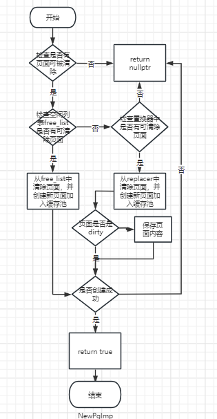
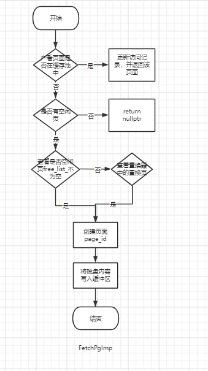

# LRU_K 与 buffer_pool_manager_instance

## LRU_K 页面置换算法

工作原理：相比LRU，LRU-K需要多维护一个队列，用于记录所有缓存数据被访问的历史。只有当数据的访问次数达到K次的时候，才将数据放入缓存。当需要淘汰数据时，LRU-K会淘汰第K次访问时间距当前时间最大的数据。   

   
(1)数据第一次欸访问，加入到访问历史列表;  
(2)如果数据在访问列表后就没有达到K次访问，则按照一定规则(FIFO,LRU)淘汰;  
(3)当访问历史队列中的数据访问次数达到K次后，将数据索引从历史队列中删除，将数据移到缓存队列中，并缓存此数据，缓存队列重新按照时间排序；  
(4)缓存数据队列中被再次访问后，重新排序；  
(5)需要淘汰数据时，淘汰缓存队列中排在末尾的数据;  
LRU-K具有LRU的优点，同时避免LRU的缺点，实际应用中LRU-2是综合各种因素后的最优选择，LRU-3或者更大的K值命中率会高，但适应性差，需要大量的数据访问才能将历史访问记录清除掉
  

## 缓存池管理示例 buffer_pool_manage_instance
### 变量含义：
  Page *pages_;   // 缓存池页列表   
  DiskManager *disk_manager_ __attribute__((__unused__)); // 磁盘管理指针  
  LogManager *log_manager_ __attribute__((__unused__));  // 日志管理指针  
  ExtendibleHashTable<page_id_t, frame_id_t> *page_table_; // Page表，用于跟踪缓冲池页面,保存page_id,frame_id  
  LRUKReplacer *replacer_;  // 使用置换器查找未固定的页面   
  std::list<frame_id_t> free_list_; // 空闲页面编号列表   
  std::mutex latch_;  // 锁    

### NewPgImp方法流程图

   

### FetchPgImp方法流程图

   