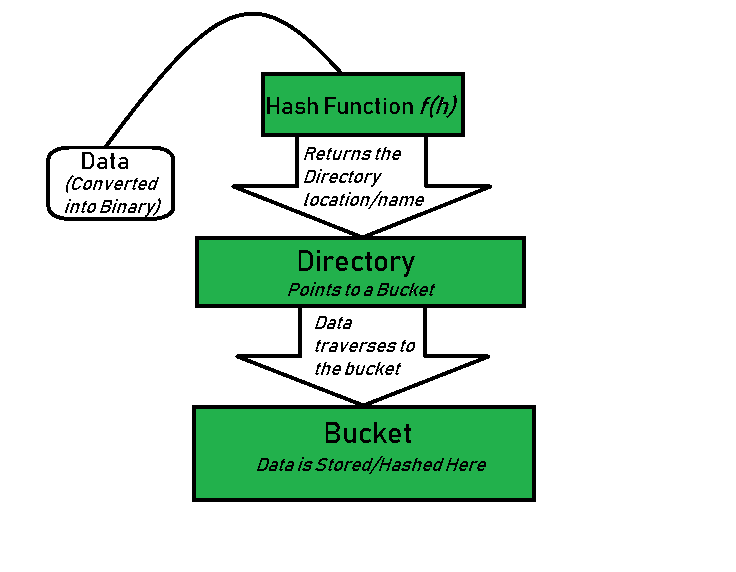

# Project 1 - Buffer Pool

## 可扩展hash

### 变量介绍：
目录(directories): 这个容器存储指向桶的指针。每个目录给定一个唯一的id，当扩张发生时id可能随之改变。哈希函数返回这个目录的id，这个id被用来指向合适的桶。$$$$目录的数量 = 2^{全局深度} $$$$   
桶(bucket)：它们存储哈希键。目录指向桶。如果局部深度小于全局深度时，一个桶可能包含不止一个指针指向它。(这里是链表结构)  
全局深度(global depath): 它跟目录相关联。它们表示哈希函数使用的比特位数目去分类这些键。全局深度=目录id的比特位数。
桶分裂(bucket splitting):当桶的元素超过了特定的大小，那么桶分裂成两个部分。  
目录扩充(directory expansion):当桶溢出时，产生目录扩容。当溢出桶的局部深度等于全局深度时，目录扩容被执行。  

### 可扩展hash基本流程：

  
注意：1-4步为hash函数检测bucket索引的操作，5-9为根据索引找到响应的桶进行插入操作  
步骤1：分析数据元素：数据元素可能以各种形式存在，比如整形，字符串，浮点数等等...当前，我们考虑整形这类数据元素，比如49。  
步骤2：转换成二进制形式：将数据元素转换为二进制形式。对于字符串元素，考虑ASCII码起始字符的对应整数，然后转换成二进制形式。因为我们是将49作为数据元素，它的二进制形式是11001。  
步骤3：检查目录的全局深度：假设哈希目录的全局深度是3。  
步骤4：识别目录：考虑在二进制下最低“全局深度”位，然后去匹配目录id。比如，二进制是：110001，全局深度是3，所以哈希函数会返回110001最后三位，即001。  
步骤5：导航：现在，访问目录id=001指向的桶。  
步骤6：插入和溢出检查：插入元素并且检查桶是否溢出。如果遇到溢出，转向步骤7和步骤8，否则转到步骤9。  

### 参考连接
参考连接1：https://ym9omojhd5.feishu.cn/docx/Fk5MdLNJuopJGaxcDHncC9wZnDg --飞书  
参考连接2：https://www.geeksforgeeks.org/extendible-hashing-dynamic-approach-to-dbms/ --可扩充哈希-英文文档 
参考连接3：https://www.zhihu.com/question/476720214/answer/2857876888 -- 可扩充hash-知乎 

